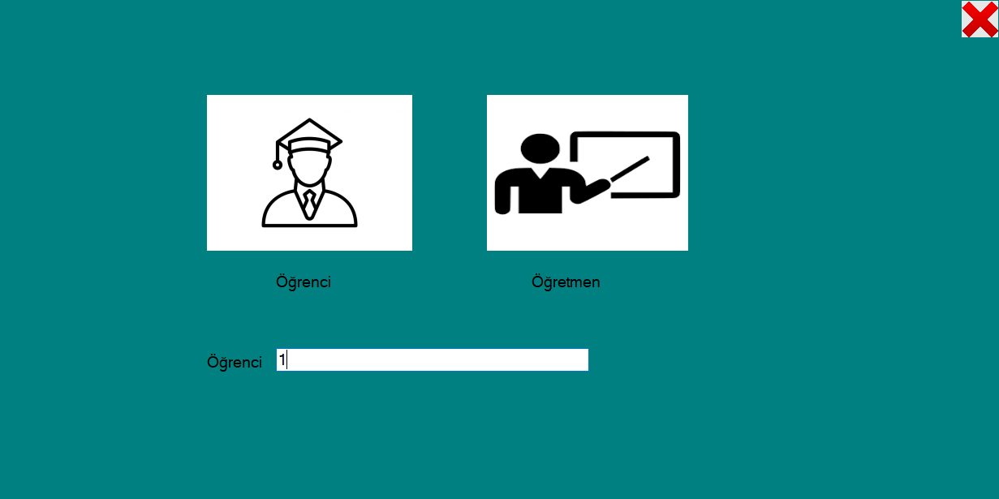
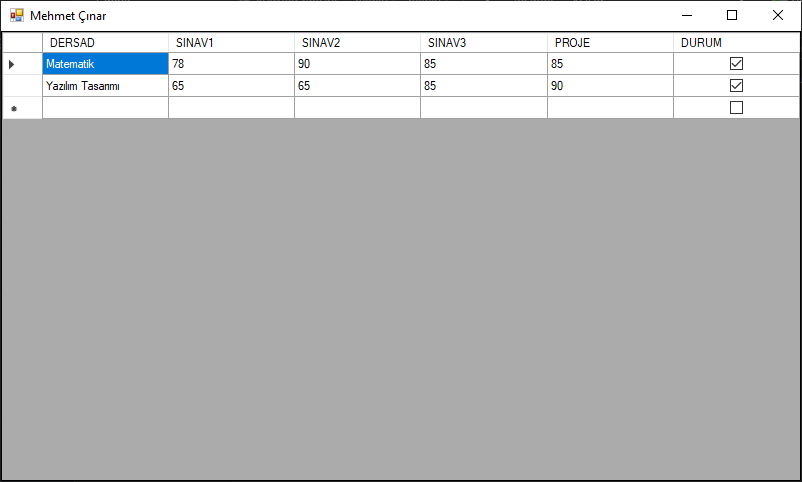

# Okul_Projesi
* Projede Okul Not sistemi yapılmıştır. 
Bu proje .net Framework 4.7.2 ortamında C# ile yazılmıştır.
# Programa Giriş Yapılır.
## Öğrenci Giriş
* Burada öğrenci not sistemine girerek almış olduğu notları görür. Dersten geçip geçmediğini 'Durum' başlığından görmüş olur

